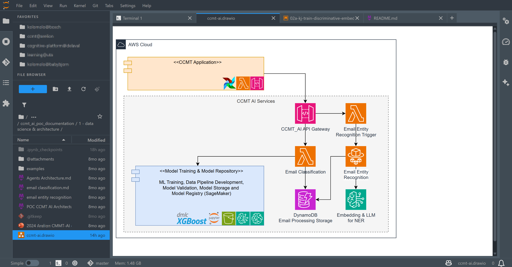

# jupyterlab_drawio_render_extension

[](https://github.com/stellarshenson/jupyterlab_drawio_render_extension-/actions/workflows/build.yml)
[](https://www.npmjs.com/package/jupyterlab_drawio_render_extension)
[](https://pypi.org/project/jupyterlab-drawio-render-extension/)
[](https://pepy.tech/project/jupyterlab-drawio-render-extension)
[](https://jupyterlab.readthedocs.io/en/stable/)
[](https://kolomolo.com)
[](https://www.paypal.com/donate/?hosted_button_id=B4KPBJDLLXTSA)

View Draw.io diagrams directly in JupyterLab. Open any `.drawio` or `.dio` file and see it rendered with full fidelity - text, shapes, stencils, icons, and styles matching the official Draw.io application.

This extension uses the official [Draw.io viewer library](https://github.com/jgraph/drawio) from jgraph, served locally from the server extension for offline capability and CSP compliance.



## Features

- **Full Draw.io rendering** - Uses official Draw.io viewer library for pixel-perfect diagram display
- **Read-only viewer** - Safe viewing without accidental modifications
- **Interactive controls** - Zoom, pan, layers panel, and lightbox view
- **Configurable background** - Choose from default (theme), black, white, or custom hex color
- **Offline capable** - Viewer library served locally, no external network requests
- **JupyterLab 4 compatible** - Built for the latest JupyterLab release

## Settings

Configure the viewer background in **Settings > Draw.io Viewer**:

| Setting | Description |
|---------|-------------|
| Background | `default` (theme), `black`, `white`, or `custom` |
| Custom Background Color | Hex color (e.g., `#f0f0f0`) when background is set to `custom` |

## Requirements

- JupyterLab >= 4.0.0
- Python >= 3.10

## Installation

```bash
pip install jupyterlab-drawio-render-extension
```

## Uninstall

```bash
pip uninstall jupyterlab-drawio-render-extension
```
